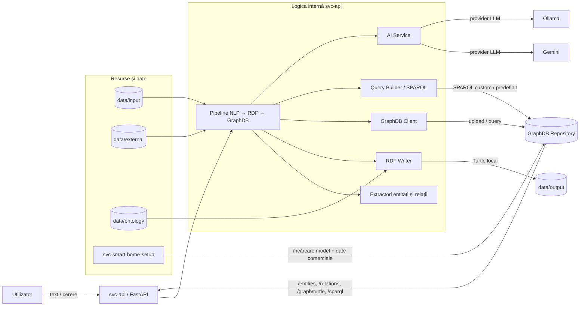

# Documentație Proiect: Smart Home Semantic Management

## 1. Scenariu de Utilizare
Utilizatorul dorește să gestioneze și să interogheze starea unei case inteligente folosind limbajul natural (Română sau Engleză). În loc să navigheze prin meniuri complexe sau să scrie interogări tehnice, acesta poate trimite comenzi sau întrebări text precum:
- "Care sunt dispozitivele din bucătărie?"
- "Afișează toate actuatoarele de tip aer condiționat."
- "Care este distribuția dispozitivelor pe clase energetice?"
- "Ce senzori sunt conectați la Smart Hub-ul din living?"
- "Care sunt dipozitivele produse de Samsung?"

Sistemul procesează aceste cereri, identifică intenția, generează automat interogările semantice necesare și returnează datele din baza de date GraphDB, combinând informațiile structurale (unde se află dispozitivele) cu cele comerciale (brand, preț, clasă energetică).

## 2. Problema Adresată
Proiectul rezolvă dificultatea corelării datelor din surse eterogene:
- **Date Structurale**: Exportate din ADOxx (format XML/TTL), care descriu ierarhia casei (camere, etaje) și conexiunile fizice dintre hub-uri și senzori/actuatoare.
- **Date Comerciale**: Fișiere CSV care conțin detalii despre brand, preț și eficiență energetică.
- **Interfața de Interogare**: Lipsa unui mecanism simplu pentru utilizatori non-tehnici de a accesa aceste date corelate fără a cunoaște SPARQL sau schema ontologiei.

## 3. Funcționalități Implementate

### A. Integrare și Stocare Semantică (GraphDB)
- **Încărcare Automată**: Scripturi Python (`load_to_graphdb.py`) pentru popularea repository-ului GraphDB cu modelul Smart Home.
- **Combinare Date**: Un mecanism (`combine_data.py`) care face "join" între obiectele din modelul ADOxx și atributele comerciale din CSV, creând un graf unitar.

### B. Procesare Limbaj Natural (NLP)
- **Pipeline Hybrid**:
    - **Bazat pe Reguli**: Extracție rapidă și precisă a entităților (camere, dispozitive) folosind spaCy și regex.
    - **Bazat pe AI (LLM)**: Integrare cu agenți AI (Ollama/Llama 3.2 local sau Google Gemini cloud) pentru a înțelege contextul și a genera interogări SPARQL complexe.
- **NL2SPARQL Dinamic**: Transformarea textului în cod SPARQL valid care respectă prefixele și relațiile ontologiei (ex: utilizarea corectă a `mm:from` și `mm:to` pentru relații).

### C. API Multi-funcțional (svc-api)
- **Endpoint-uri SPARQL**: Permite execuția de interogări personalizate sau predefinite.
- **Endpoint-uri de Procesare**: `/process/text` (reguli) și `/process/ai/text` (AI) pentru conversia limbaj natural -> rezultate DB.
- **Multi-Provider AI**: Posibilitatea de a comuta între Ollama și Gemini prin simple variabile de mediu.

### D. Documentație și Structură
- **Arhitectură Modulară**: Separare clară între clienți (GraphDB, Ollama, Gemini), extractori, rutere și modele de date.
- **Documentație Tehnică**: `STRUCTURE.md` detaliază rolul fiecărui script din proiect.

## 4. Structura de directoare 

La nivelul rădăcinii proiectului există următoarele directoare, fiecare cu un rol distinct:

- `data/` — fișiere de date ale proiectului, incluzând resursele de intrare, ieșire și datele suport folosite de servicii;
- `images/` — imagini și resurse grafice folosit in ADOxx pentru reprezentarea dispozitivelor, screenshot cu diagrama completa ;
- `scripts/` — scripturi și fișiere auxiliare folosite pentru scenarii, export și transformări in ADOxx ;
- `svc-api/` — serviciul FastAPI care procesează textul, generează RDF și interacționează cu GraphDB;
- `svc-llm/` — infrastructura și resursele pentru componenta LLM locala;
- `svc-smart-home-setup/` — scripturi de inițializare și combinare a datelor pentru popularea GraphDB.

## 5. Diagramă logică a sistemului

Diagrama de mai jos reflectă componentele logice principale și modul în care interacționează:

### Interpretare rapidă

- **Utilizatorul** trimite cereri text sau fișiere către API.
- **`svc-api`** orchestrează întregul flux de procesare.
- **Extractorii** identifică entități și relații din text.
- **RDF Writer** construiește și serializează graful Turtle.
- **GraphDB Client** încarcă datele și execută interogări SPARQL.
- **AI Service** poate genera extracții și query-uri prin provider-ul configurat.
- **`svc-smart-home-setup`** pregătește repository-ul și datele comerciale pentru integrare.

